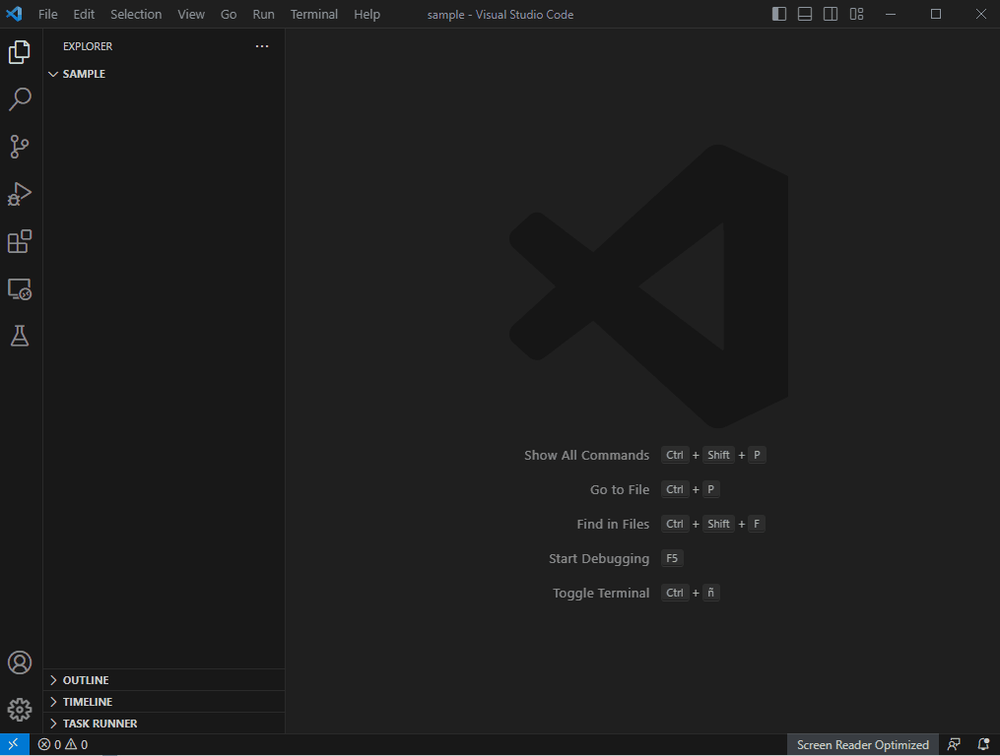

# Datascientists Utils

> Seamlessly migrate to Visual Studio Code: Empowering data scientists to effortlessly transition from Jupyter to a superior coding experience. Right now we deal with HTML/TOC exports within VSCode and translations from Jupyter notebooks to percent scripts via [Jupytext](https://jupytext.readthedocs.io/en/latest/index.html).

## Features

- Transform notebooks to pure python scripts, via [Jupytext](https://jupytext.readthedocs.io/en/latest/index.html).
- Transform py percent Python scripts to Notebooks, via [Jupytext](https://jupytext.readthedocs.io/en/latest/index.html).
- Export HTML versions of Notebook with a dynamically allocated Table of Contents, via [nbconvert](https://nbconvert.readthedocs.io/en/latest/).

### Next releases:
- Style control over Table of Contents.
- Automatic sync between paired notebooks and scripts.
- Export to PDF.

## Installation

1. Launch Visual Studio Code.
2. Go to the Extensions view (`Ctrl+Shift+X` or `Cmd+Shift+X` on macOS).
3. Search for "Datascientists Utils" and click **Install**.
4. Restart Visual Studio Code if prompted.
5. On Extensions' setting page go to Datascience utils and add the full path to a python interpreter and a html exported folder.

## Usage

1. Describe how to access and utilize your extension's functionality.
2. Provide examples and code snippets if applicable.
3. Explain any settings or configurations users might need to set up.

## Contributing

Contributions are welcome! Please follow these steps to contribute to the project:

1. Fork the repository.
2. Create a new branch for your contribution.
3. Make your changes and commit them.
4. Push your changes to your fork.
5. Submit a pull request to the main repository.

Please ensure your pull request adheres to the project's guidelines and conventions.

## Release History

- **Version 0.0.6** (2023-08-16)
  - Adds a fix to TOC positioning on html export. Now is always on top of every html element.

- **Version 0.0.5** (2023-07-18)
  - Adds command cntrl + shift + s por autopairing paired notebooks.

- **Version 0.0.1-4** (2023-07-17)
  - Pre-release version for testing and early feedback.
  - Included feature of exporting percent scripts to notebooks via Jupytext.
  - Included feature of exporting notebooks to percent scripts via Jupytext.
  - Included feature of exporting notebooks to HTML with a JS defined Table of Contents.

For a complete list of releases and changes, please refer to the [Changelog](./CHANGELOG.md).

## Feedback and Support

- If you encounter any issues or have suggestions, please [create an issue](https://github.com/fmilanese-1/ds_utils/issues).
- Feel free to reach out to me through [email](mailto:francomilanese@angloamerican.com) or [Linkedin](https://cl.linkedin.com/in/franco-milanese-88b780116).

## License

This project is licensed under the [Modified BSD License](./LICENSE.md).
