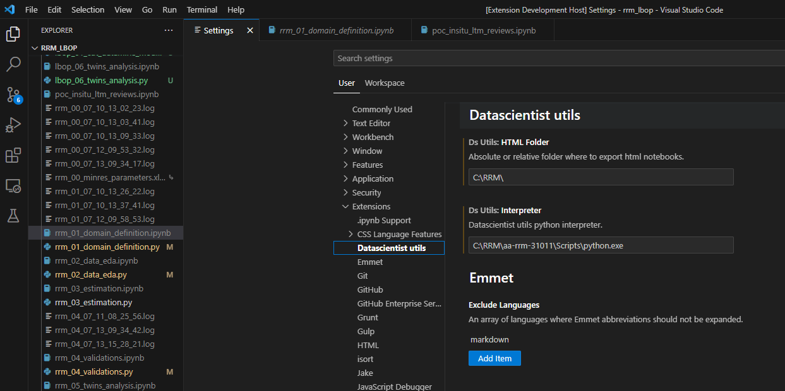

# Datascientists Utils

> Your extension's tagline or brief description.

## Features

- List the main features and functionalities of your extension.
- Highlight how it solves the problems or provides value to users.
- You can include screenshots or GIFs to demonstrate the usage.

## Installation

1. Launch Visual Studio Code.
2. Go to the Extensions view (`Ctrl+Shift+X` or `Cmd+Shift+X` on macOS).
3. Search for "Datascientists Utils" and click **Install**.
4. Restart Visual Studio Code if prompted.
5. On Extensions' setting page go to Datascience utils and add the full path to a python interpreter and a html exported folder.

## Usage

1. Describe how to access and utilize your extension's functionality.
2. Provide examples and code snippets if applicable.
3. Explain any settings or configurations users might need to set up.

## Contributing

Contributions are welcome! Please follow these steps to contribute to the project:

1. Fork the repository.
2. Create a new branch for your contribution.
3. Make your changes and commit them.
4. Push your changes to your fork.
5. Submit a pull request to the main repository.

Please ensure your pull request adheres to the project's guidelines and conventions.

## Release History

- **Version 0.1.0** (2023-07-17)
  - Pre-release version for testing and early feedback.
  - Included feature of exporting percent scripts to notebooks via Jupytext.
  - Included feature of exporting notebooks to percent scripts via Jupytext.
  - Included feature of exporting notebooks to HTML with a JS defined Table of Contents.

For a complete list of releases and changes, please refer to the [Changelog](./CHANGELOG.md).

## Feedback and Support

- If you encounter any issues or have suggestions, please [create an issue](https://github.com/fmilanese-1/ds_utils/issues).
- Feel free to reach out to me through [email](mailto:your@email.com) or [Twitter](https://twitter.com/your_twitter).

## License

This project is licensed under the [MIT License](./LICENSE).
